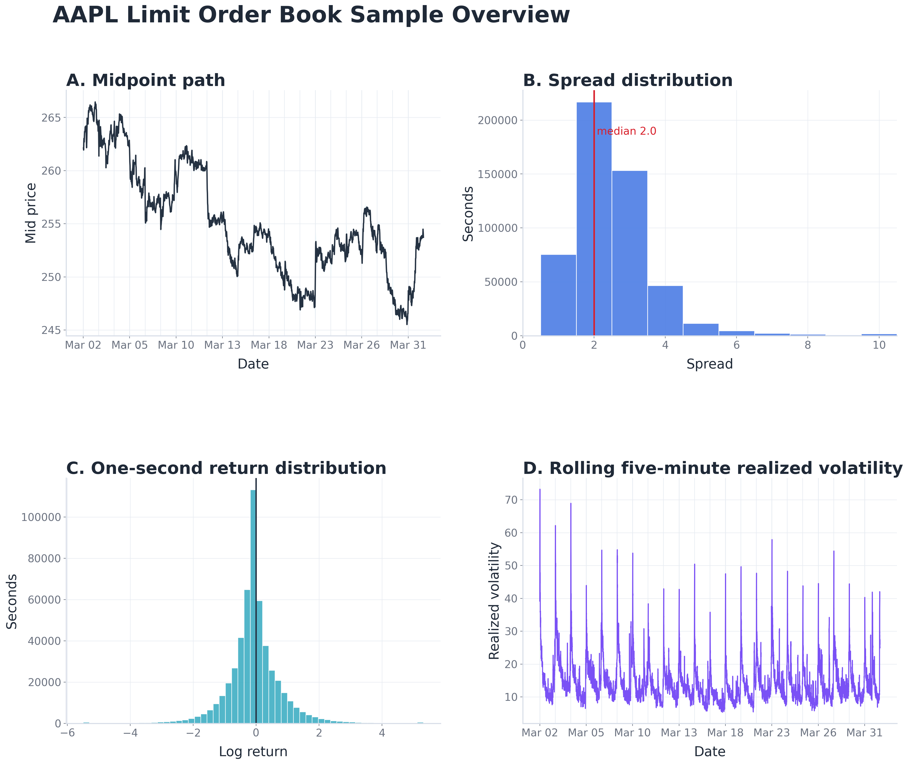

# Signal-Aware Market Making with Inventory Control

**Author:** Markos Markides  
**Affiliation:** Department of Accounting & Finance, University of Cyprus, Nicosia, Cyprus

## Abstract

This paper investigates whether short-horizon predictive information can improve an inventory-aware market-making strategy. The core contribution is a signal-aware extension of the Avellaneda and Stoikov market-making framework, in which forecasts of future market conditions are incorporated into the quoting rule through adjustments to inventory pressure and reservation price skew while preserving an interpretable analytical structure. The empirical results show that the forecast based extension improves risk-adjusted performance and reduces inventory exposure relative to the baseline. This suggests that the proposed architecture can use predictive information effectively, and that forecast quality remains the main limitation rather than the market-making framework itself.

## Keywords

Market making; limit order book; Avellaneda and Stoikov; predictive signals; inventory risk; market microstructure

## 1. Introduction

Market making is a trading strategy in which a trader continuously provides liquidity by posting both buy and sell orders. The market maker earns the bid-ask spread, but also faces two central risks: adverse selection and inventory risk. These risks make quote placement a dynamic problem rather than a simple spread-capturing strategy.

This paper investigates whether short-horizon predictive information can improve the behaviour of an inventory-aware market-making strategy without replacing the economic structure of the quoting model. The starting point is the Avellaneda and Stoikov framework, which provides an interpretable rule for adjusting quotes around a reservation price. Its structure is attractive because inventory, volatility, and risk aversion each have clear economic roles. However, real limit order book conditions are time-varying, suggesting that a fixed baseline specification may not fully adapt to changing short-horizon risk and order flow pressure.

The core contribution of this paper is a signal-aware extension of the Avellaneda and Stoikov quoting rule. Forecasts of future market conditions are not used to learn a trading policy directly. Instead, they enter the analytical framework through two controlled mechanisms: volatility adjusts the inventory pressure term, and directional information shifts the reservation price through a signed skew. This preserves the interpretability of the original framework while allowing quotes to respond to short-term market conditions.

The empirical analysis uses high-frequency AAPL limit order book data from the LOBSTER dataset. The study compares a fixed volatility baseline, a learned signal-aware extension, and an oracle extension that uses realized future information as a diagnostic benchmark. The oracle is not intended to be tradable; it is used to separate the value of the quoting architecture from the quality of the predictive signals supplied to it.

The results show that the forecast based extension improves risk-adjusted performance and reduces inventory exposure relative to the baseline. The oracle benchmark performs substantially better, suggesting that the proposed architecture can use predictive information effectively, and that forecast quality remains the main limitation rather than the market-making framework itself.

## 2. Related Literature

### 2.1 Market Making and Its Risks

Market microstructure theory treats market making as a problem of liquidity provision under risk. By posting buy and sell quotes, the market maker offers liquidity to other traders and earns compensation through the bid-ask spread. This compensation, however, comes with exposure to adverse selection and inventory risk. These two risks motivate much of the theoretical literature reviewed below.

### 2.2 Adverse Selection and Asymmetric Information Risk

In classical microstructure models, the bid-ask spread compensates market makers for the risk of trading against better-informed traders. In Glosten and Milgrom [1], trades arrive sequentially and the market maker cannot distinguish informed from uninformed traders. Instead, information is inferred from whether a trade is a buy or a sell. As the likelihood or precision of informed trading increases, the expected loss from each trade rises. Market makers therefore widen spreads to remain competitive and avoid systematic losses.

Kyle [2] demonstrates that when market makers cannot tell whether trades are informed or not, information is gradually incorporated into prices through buying and selling pressure. In this setting, order flow becomes informative, and trades themselves cause price movements. Liquidity provision is therefore especially risky during periods of strong order flow imbalance, when informed trading is more likely.

Easley and O'Hara [3] further reinforce that even with competitive, risk-neutral market makers, quoted prices deviate from prior values due to the possibility of information-based trading. Building on this insight, Easley et al. [4] propose the Probability of Informed Trading (PIN), an empirically implementable measure of information risk estimated from observable trade arrival dynamics. Together, these models frame adverse selection as a central driver of bid-ask spreads and motivate adaptive market-making policies that respond to "toxic" order flow conditions. For the present study, the importance of this literature is not that the market maker can directly identify informed traders, but that observable order flow and limit order book conditions may contain short-horizon directional information relevant for quote placement.

### 2.3 Inventory Risk and Dealer Quote Adjustment

In parallel to asymmetric information risk, market microstructure theory has long emphasized inventory risk as a fundamental determinant of dealer pricing behavior. Ho and Stoll [5] show that risk-averse dealers optimally adjust bid and ask quotes in response to inventory imbalances, since holding positions exposes them to price uncertainty. In this framework, dealers shift quotes away from the mid price to encourage trades that reduce undesirable inventory exposure, even in the absence of informed trading.

These mechanisms are extended to competitive dealer markets by Ho and Stoll [6], who highlight the role of inventory dependent reservation prices in determining equilibrium bid and ask quotes. More recently, Avellaneda and Stoikov [7] formalize inventory risk control in a continuous-time, high-frequency setting, deriving optimal inventory adjusted quoting strategies under stochastic prices and order arrivals.

Recent work has explored incorporating predictive signals into market-making strategies using fully data-driven approaches, including deep reinforcement learning frameworks that jointly learn quoting policies from order book states and auxiliary forecasts. For example, Gašperov and Kostanjčar [8] embed volatility and trend signals into a reinforcement learning agent that directly controls bid and ask quotes, while other empirical studies investigate spread setting mechanisms that adapt to volatility based on econometric forecasts [9]. While such approaches offer considerable flexibility, they often replace analytical structure with black-box control policies.

In contrast, this work adopts a hybrid approach. Rather than learning the entire quoting strategy directly, it focuses on forecasting short-horizon volatility and directional signals and incorporating these forecasts into the analytical, inventory-aware quoting rules of Avellaneda and Stoikov [7]. This design preserves the interpretability and economic structure of the analytical market-making framework (as detailed in the methodology section), while allowing quotes to respond to changing volatility, liquidity, and short-term order flow pressure.

### 2.4 Predictive Signals: Volatility and Direction

Volatility and direction are the two predictive signals used in this study to adapt the inventory-aware quoting rule. Volatility is important because it determines the risk of carrying inventory between trades and therefore affects optimal quote placement in inventory based market-making models [7]. In the baseline Avellaneda and Stoikov framework, volatility is treated as fixed for tractability, but empirical limit order book data exhibit changing short-horizon risk conditions throughout the trading day. This motivates the use of volatility forecasts as adaptive inputs to the inventory pressure term of the quoting rule.

Directional information plays a different role. It is used only to shift the market maker's quotes toward the expected short-term price movement. This reflects the idea that short-term order flow pressure may contain information about near-term price movements, while preserving the analytical structure of the market-making model. In this design, volatility controls how costly inventory is, while direction determines how the reservation price is shifted.

### 2.5 Volatility Models

Accurate intraday volatility forecasting is essential for risk management and trading applications, particularly in high-frequency settings where inventory exposure and quote placement are highly sensitive to short-term risk [10]. This has motivated extensive research into models capable of capturing the dynamic behavior of realized volatility at high frequencies.

Classical approaches to volatility modeling originate from the conditional heteroskedasticity literature. The GARCH family introduced by Bollerslev [11] models conditional variance dynamics using past squared returns and past variance and remains a standard benchmark. However, at high frequencies, realized volatility exhibits strong persistence across multiple time scales that is not fully captured by low-order GARCH specifications.

To address this limitation, Corsi [12] proposes the Heterogeneous Autoregressive (HAR) model, which represents realized volatility dynamics through components aggregated over different horizons. Building on this structure, Bollerslev et al. [13] account for time-varying measurement error in realized volatility and introduce HARQ-type adjustments that improve forecast accuracy under robust loss functions such as QLIKE.

Machine learning methods provide flexible alternatives to classical econometric models by allowing nonlinear relationships and the use of high-dimensional predictors derived from high-frequency data. In practice, tree-based ensemble methods are often strong performers for volatility forecasting due to their robustness and ability to handle heterogeneous features. A prominent example is XGBoost, introduced by Chen and Guestrin [14], which has become a standard baseline for tabular financial prediction tasks, including intraday volatility forecasting.

Neural-network architectures offer additional flexibility for modeling temporal dependence. In particular, Long Short-Term Memory (LSTM) networks [15] are designed to capture longer-range dependencies in sequential data and have been applied to volatility dynamics. However, their empirical performance in high-frequency settings often depends critically on feature design, data volume, and careful regularization.

Recent research also shows that volatility-relevant information can be extracted directly from limit order book (LOB) data. Zhang et al. [16] demonstrate that deep neural networks can learn informative representations of LOB states for short-horizon market dynamics.

Rather than learning volatility dynamics directly from raw order book states, this work focuses on combining engineered features derived from trades and order flow with machine learning models to produce short-horizon volatility forecasts that are stable, interpretable, and suitable for integration into an analytical market-making framework.

### 2.6 Forecast Evaluation and the Role of QLIKE

Evaluating volatility forecasts is challenging because true volatility is not directly observable. Instead, researchers usually compare forecasts with realized volatility, which is computed from observed price changes over a future window. Realized volatility is useful, but it is still only an estimate of the underlying volatility. As a result, standard loss functions such as mean squared error (MSE) may give misleading model rankings if they reward closeness to a noisy volatility proxy rather than closeness to the true volatility being forecast [17].

Patton [18] shows that the QLIKE loss function is robust to such measurement error and yields consistent model comparisons even when realized volatility is an imperfect proxy for the latent variance. For this reason, QLIKE is used as the primary evaluation metric for volatility forecasts in this work.

### 2.7 Directional Signals and Quote Skewing

In addition to volatility forecasting, short-horizon directional signals can provide useful information for market making by capturing temporary imbalances in order flow. Classical microstructure models show that order flow can be informative when market makers cannot distinguish informed from uninformed traders [2].

Rather than attempting to forecast returns or learn a fully data-driven quoting policy, this work uses directional information in a simple and controlled way. Predicted direction is used to asymmetrically shift bid and ask quotes around the reservation price, effectively skewing quotes toward the side with higher expected pressure.

This approach preserves the analytical structure and interpretability of the Avellaneda and Stoikov framework, while allowing quotes to react to short-term market conditions. It is consistent with signal-based market-making approaches such as Gašperov and Kostanjčar [8], but avoids replacing the model with a black-box control policy.

Directional forecasts are evaluated using standard classification metrics, with particular attention to F1 score because the task involves multiple direction classes. Their economic value is then judged by whether they improve the resulting market-making strategy.

The directional signal does not need to be perfectly accurate in order to be useful. It is valuable if the expected benefit from shifting quotes in the predicted direction is positive after accounting for fills, inventory, and price movements. Standard classification metrics such as F1 score are useful for measuring predictive quality, but the final test is whether the signal improves the market-making strategy when incorporated into the quoting rule.

### 2.8 Summary and Positioning

In summary, the literature motivates two central risks for market makers: adverse selection from informative order flow and inventory risk from holding positions while prices move. The Avellaneda and Stoikov framework provides an interpretable way to manage inventory risk through reservation price and spread adjustments, while the forecasting literature shows that short-horizon volatility and direction can contain useful information about changing market conditions.

This paper is positioned between analytical market-making models and data-driven prediction methods. Rather than replacing the quoting rule with a fully learned policy, it incorporates predictive information into specific components of the Avellaneda and Stoikov framework. Volatility affects the inventory pressure term, while direction determines how the reservation price is shifted. The contribution is therefore not a new forecasting model, but a transparent methodology for using predictive signals inside an interpretable market-making strategy and evaluating their effect through historical backtesting.

## 3. Data and Exploratory Analysis

### 3.1 Data Source

The empirical analysis uses high-frequency AAPL limit order book data from LOBSTER. The data consist of an order book file sampled at one second intervals and a corresponding event message file. The book file provides the state of the limit order book on a one second grid, while the event file records timestamped order book messages such as submissions, cancellations, deletions, and executions. Together, these files support both feature construction and an event-based historical backtesting framework, where execution messages are used to approximate whether posted quotes would have been filled.

### 3.2 Book and Event Files

The book file contains 514,332 observations sampled on a one second grid from 2026-03-02 to 2026-03-31. It records a 10-level limit order book, including the midpoint, bid and ask prices, and displayed bid and ask sizes at each level. These variables provide the market state observed by the market maker and are used to describe liquidity, spread, depth, imbalance, and microprice conditions.

The event file contains timestamped order book messages over the same period, including order submissions, cancellations, deletions, and executions. These messages have two roles in the study. First, they are aggregated into event-based features such as trading activity and order flow pressure. Second, execution messages are used to build an event-based historical backtesting framework in which fill decisions are based on observed executions in the market.

### 3.3 Training and Test Split

The sample is divided into a training period and a held out test period. The split is time ordered: earlier observations are used to construct features, labels, and forecasting artifacts, while later observations are reserved for final out of sample prediction and backtesting. This avoids using future information when evaluating the market-making strategies.

After feature and label construction, the training sample contains 396,718 observations from 17 trading sessions, and the test sample contains 116,734 observations from 5 trading sessions. All reported strategy results are computed on the held out test period.

### 3.4 Data and Descriptive Statistics

The AAPL limit order book sample displays several features that are relevant for the market-making problem. The midpoint series varies meaningfully over the sample period, while the spread distribution shows that most observations occur at narrow spreads. One-second returns are concentrated around zero but have non-negligible tails, and realized volatility varies substantially through time.

**Figure 1. AAPL limit order book sample overview.**

These patterns motivate the empirical design. Narrow spreads shape the quoting problem, while time-varying volatility affects the risk of carrying inventory. The return and volatility dynamics also motivate the short-horizon direction and volatility signals used in the strategy.

## 4. Methodology

The methodology is designed to test whether predictive information can improve an inventory-aware quoting rule without replacing the economic structure of the market-making model. The empirical design begins by defining the benchmark quoting rules, including a constant spread strategy and the baseline Avellaneda and Stoikov strategy. It then introduces the signal-aware extension, where short-horizon volatility and direction forecasts are incorporated into the reservation price. Finally, the strategies are evaluated under the same event-based historical backtesting framework.

The objective is not to replace market making with a black-box prediction model. The objective is to test whether predictive information can be inserted into a structured inventory-aware quoting rule in a transparent way.

### 4.1 Constant Spread Benchmark

The constant spread benchmark provides the simplest quoting rule in the strategy comparison. At each second, it posts symmetric bid and ask quotes around the midpoint. If $m_t$ is the midpoint and $c$ is the fixed half spread, the raw quotes are

$$
p^{bid}_t = m_t - c, \qquad p^{ask}_t = m_t + c
$$

This benchmark does not respond to inventory, volatility, directional information, or remaining time in the session. It is included as a plain reference strategy, allowing the inventory-aware models to be compared against a rule that supplies liquidity without active inventory control.

### 4.2 Baseline Avellaneda and Stoikov Strategy

The main theoretical benchmark is the inventory based market-making model of Avellaneda and Stoikov [7]. In this framework, the market maker chooses bid and ask quotes over a finite trading horizon while controlling the risk of accumulating inventory. The model assumes that the mid price evolves randomly and that quotes placed farther from the mid price are less likely to be executed. Under these assumptions, the dealer's optimal quotes can be expressed through an inventory adjusted reservation price and an optimal spread.

The reservation price is the center around which the market maker places bid and ask quotes after accounting for inventory. It can be interpreted as the market maker's inventory adjusted valuation of the asset. When inventory is positive, the reservation price moves below the midpoint to encourage selling; when inventory is negative, it moves above the midpoint to encourage buying. Let $s$ be the current mid price, $q$ the current inventory, $\gamma$ the inventory risk aversion parameter, $\sigma_0$ the fixed baseline volatility, and $T-t$ the remaining model time. The baseline reservation price is

$$
r(s,q,t)=s-q\gamma\sigma_0^2(T-t)
$$

The spread determines how far the bid and ask quotes are placed from the reservation price. In the Avellaneda and Stoikov model, the spread reflects both inventory risk and execution probability. Higher volatility increases the risk of holding inventory, while a longer trading horizon gives prices more time to move against the market maker. At the same time, quotes placed farther from the mid price are less likely to be executed, so the spread also depends on the liquidity of the order book. The total spread is

$$
\Delta(t)=\delta^a+\delta^b=\gamma\sigma_0^2(T-t)+\frac{2}{\gamma}\log\left(1+\frac{\gamma}{k}\right)
$$

where $k$ is the liquidity parameter governing how quickly execution intensity declines as quotes are placed farther from the mid price. The first term is the inventory risk component, while the second term captures the trade-off between earning spread and maintaining execution probability.

The bid and ask quotes are placed symmetrically around the reservation price:

$$
p^{bid}(s,q,t)=r(s,q,t)-\frac{1}{2}\Delta(t), \qquad p^{ask}(s,q,t)=r(s,q,t)+\frac{1}{2}\Delta(t)
$$

This baseline is inventory-aware but not signal-aware. It adjusts quotes in response to inventory, volatility, and the remaining trading horizon, but it does not use short-horizon forecasts. In the empirical comparison, it therefore serves as the reference strategy against which the signal-aware extension is evaluated.

### 4.3 Signal-Aware Strategy

The proposed extension modifies the reservation price of the Avellaneda and Stoikov model while keeping the quoting rule interpretable. The strategy uses two short-horizon forecasts. The volatility forecast changes the strength of the inventory penalty, while the directional forecast shifts the reservation price toward the predicted price movement.

The extended reservation price is

$$
r^{ext}(s,q,t,\hat{\sigma}_t,\hat{d}_t)=s-q\gamma\sigma^2_{eff}(t)(T-t)+\delta_{\text{tick}}\hat{d}_t
$$

where $\hat{d}_t$ is the signed directional forecast,

$$
\hat{d}_t=\begin{cases}-1,&\text{down}\\0,&\text{neutral}\\+1,&\text{up}\end{cases}
$$

and $\delta_{\text{tick}}$ is the tick size.

The volatility forecast enters through the effective inventory risk term. Let $\hat{\sigma}_t$ denote the volatility forecast, expressed in the same units as the baseline volatility $\sigma_0$. We define

$$
\sigma^2_{eff}(t)=\sigma_0^2\left[1+\alpha\left(\left(\frac{\hat{\sigma}_t}{\sigma_0}\right)^2-1\right)\right]
$$

where $\alpha$ controls the sensitivity to deviations from baseline volatility. When predicted volatility is above $\sigma_0$, inventory is penalized more strongly; when predicted volatility is below $\sigma_0$, the inventory penalty is reduced.

The quoted spread is kept equal to the baseline spread:

$$
\Delta^{ext}(t)=\Delta(t)
$$

Thus, the extension changes the center of the quotes but not their distance from that center. Volatility changes the inventory penalty, direction shifts the reservation price, and the spread remains anchored to the baseline Avellaneda and Stoikov rule. The bid and ask quotes are

$$
p^{bid,ext}(s,q,t)=r^{ext}(s,q,t)-\frac{1}{2}\Delta^{ext}(t), \qquad p^{ask,ext}(s,q,t)=r^{ext}(s,q,t)+\frac{1}{2}\Delta^{ext}(t)
$$

This design keeps the economic structure of the baseline model while allowing predictive information to enter the quoting rule in a controlled way.

### 4.4 Volatility and Direction Signals

The signal-aware strategy uses two short-horizon forecasts: direction and volatility. Both are defined from future midpoint price movements and then predicted using information available at the quote time.

To formulate the directional signal, we first characterize the future price level using the time-averaged midpoint over the subsequent $H$ seconds:

$$
\bar{m}_{t,H} = \frac{1}{H}\sum_{i=1}^{H}m_{t+i}
$$

We then compare this future average with the current midpoint by expressing the difference as a log return:

$$
R^{dir}_{t,H} = \log\left(\frac{\bar{m}_{t,H}}{m_t}\right)
$$

The sign and size of $R^{dir}_{t,H}$ indicate whether the future average midpoint is meaningfully below, above, or close to the current midpoint. This continuous measure is then converted into a directional label, $d_{t,H}$, using lower and upper thresholds, $\theta_{down}$ and $\theta_{up}$:

$$
d_{t,H} = \begin{cases} 
-1, & R^{dir}_{t,H} < \theta_{down} \\ 
+1, & R^{dir}_{t,H} > \theta_{up} \\ 
0, & \theta_{down} \le R^{dir}_{t,H} \le \theta_{up} 
\end{cases}
$$

Thus, $-1$ represents a downward movement, $+1$ represents an upward movement, and $0$ represents a neutral movement.

In parallel, the volatility signal captures the expected price variation over the identical future horizon. We define this metric as the forward realized log-volatility:

$$
y^{vol}_{t,H} = \sqrt{\sum_{i=1}^{H}\left(\log m_{t+i} - \log m_{t+i-1}\right)^2}
$$

These forward-looking directional and volatility metrics serve as the target variables for the forecasting models. The resulting predictive estimates are then integrated into the signal-aware market-making framework through the reservation price.

### 4.5 Oracle Benchmark

The oracle uses the same signal-aware Stoikov extension as the forecast based strategy, but replaces predicted signals with realized future labels. Three oracle variants are considered. The volatility only oracle uses realized future volatility in the inventory pressure term and sets the directional skew to zero. The direction only oracle keeps volatility at the baseline level and uses realized future direction as the signed skew input. The combined oracle uses both realized future volatility and realized future direction.

The role of these oracle variants is purely diagnostic: they show whether the extension can benefit from volatility information, directional information, or both. If the oracle variants perform well while the forecast based extension performs only modestly, the limitation is forecast quality rather than the quoting architecture itself.

### 4.6 Historical Backtesting and Evaluation

All strategies are evaluated using the same event-based historical backtest. At each second, the strategy submits bid and ask quotes, subject to the tick grid, inventory limits, and non-crossing constraints. Execution is determined from observed trade messages in the event file, with a simple queue-position assumption when quotes join displayed liquidity.

After executions, cash and inventory are updated. Near the end of each trading session, any remaining inventory is liquidated at the touch so that all strategies end the day flat.

The main backtest assumes zero transaction fees or rebates. This abstracts from venue-specific maker-taker fee schedules, under which liquidity-providing orders may receive rebates while liquidity-removing orders pay fees. The zero-fee specification is used to isolate differences in quoting behaviour across strategies rather than differences caused by exchange-specific fee schedules.

Performance is reported using final PnL, the standard deviation of one-second PnL changes, a one-second risk-adjusted PnL ratio, average absolute inventory, fill rate, and total traded volume. The one-second risk-adjusted PnL ratio is computed as the average one-second change in PnL divided by the standard deviation of one-second PnL changes.

## 5. Empirical Results

### 5.1 Constant Spread Benchmark

The first benchmark is a constant spread strategy. At each second, the strategy quotes around the midpoint using a fixed distance, without using inventory, volatility, or directional information. This provides a simple reference point before introducing the inventory-aware Stoikov baseline and the signal-aware extension.

Table 1 reports the constant spread backtest results. The strategy generates the highest trading volume among the initial benchmarks, but it also carries a larger average inventory position. This is expected: without an inventory-aware reservation price, the strategy does not actively adjust quotes to reduce accumulated inventory.

| Metric | Constant Spread |
|---|---:|
| Final PnL | 1,424.20 |
| PnL standard deviation | 1.564 |
| 1s risk-adjusted PnL | 0.0078 |
| Average absolute inventory | 63.49 |
| Fill rate | 0.0526 |
| Volume | 62,840 |

### 5.2 Baseline Avellaneda and Stoikov Strategy

The second benchmark is the baseline Avellaneda and Stoikov strategy. Unlike the constant spread rule, this strategy adjusts its reservation price in response to inventory. When inventory becomes positive, quotes are shifted to encourage selling; when inventory becomes negative, quotes are shifted to encourage buying. The strategy therefore trades less aggressively than the constant spread benchmark, but it is designed to control inventory exposure.

Table 2 reports the baseline Stoikov results. Final PnL is 3.4% lower than the constant spread benchmark, but average absolute inventory falls by 28.1%, from 63.49 to 45.64. The fill rate and volume are also approximately 50% lower because the strategy quotes more selectively. At the same time, the one-second risk-adjusted PnL ratio increases by 32.1%, from 0.0078 to 0.0103. This result shows the main trade-off introduced by inventory-aware quoting: the strategy gives up trading activity while improving inventory control and risk-adjusted performance.

| Metric | Baseline Stoikov |
|---|---:|
| Final PnL | 1,376.00 |
| PnL standard deviation | 1.147 |
| 1s risk-adjusted PnL | 0.0103 |
| Average absolute inventory | 45.64 |
| Fill rate | 0.0262 |
| Volume | 31,360 |

### 5.3 Oracle Upper Bounds

To understand whether the proposed extension has value in principle, the analysis first considers oracle versions of the strategy. These oracle strategies use the same signal-aware Stoikov formula, but replace the forecasted inputs with realized future information. This allows the backtest to measure the best case performance of the extension under perfect signal information. If the oracle improves on the baseline, then the extension formula has value in principle; the remaining question is whether practical forecasting methods can supply useful enough inputs.

The volatility only oracle uses realized future volatility to scale the inventory pressure term. This version does not use any predicted or realized direction signal, meaning that quotes are not skewed based on directional information. This isolates the value of the volatility component of the extension: if this oracle improves on the baseline, then time-varying inventory pressure is useful on its own.

The direction only oracle keeps volatility fixed at the baseline level and uses realized future direction to skew the reservation price. This isolates the value of the directional component: if this oracle improves on the baseline, then quote skewing based on short-horizon direction has value on its own.

The combined oracle uses both realized future volatility and realized future direction. This tests whether the two components work together. The volatility signal changes how aggressively the strategy manages inventory risk, while the direction signal changes where the quotes are centered. If the combined oracle improves beyond the individual oracle variants, this suggests that the two signals are complementary.

The oracle results show a clear difference between the two signal components. The volatility only oracle improves the risk profile of the strategy: average absolute inventory falls by 42.7% relative to the baseline, from 45.64 to 26.15, and the one-second risk-adjusted PnL ratio rises by 76.7%, from 0.0103 to 0.0182. The direction only oracle increases the one-second risk-adjusted PnL ratio by 101.9%, to 0.0208, but it does not reduce inventory exposure. The combined oracle produces the strongest risk-adjusted result. Its one-second risk-adjusted PnL ratio rises by 230.1% relative to the baseline, while average absolute inventory falls by 37.6%. This suggests that the directional signal is useful for improving trading outcomes, but the volatility signal is important for controlling inventory risk; together, they produce the best risk-adjusted performance.

These oracle results are not tradable, since they rely on realized future information. Their role is purely diagnostic. The remaining step is to replace the realized future inputs with forecasts available at the time of quoting.

| Metric | Volatility Oracle | Direction Oracle | Combined Oracle |
|---|---:|---:|---:|
| Final PnL | 1,269.60 | 2,834.30 | 2,605.20 |
| PnL standard deviation | 0.598 | 1.170 | 0.657 |
| 1s risk-adjusted PnL | 0.0182 | 0.0208 | 0.0340 |
| Average absolute inventory | 26.15 | 47.14 | 28.48 |
| Fill rate | 0.0296 | 0.0291 | 0.0328 |
| Volume | 35,460 | 34,860 | 39,220 |

### 5.4 Predictive Signal Diagnostics

The predictive results are reported as diagnostics rather than as the main contribution of the paper. The forecasting models are used only to generate volatility and direction inputs for the quoting rule. In the final implementation, both forecasts are produced using XGBoost models, a standard tree-based method commonly used for structured tabular data [14]. The main question is therefore not whether the models are state of the art, but whether simple forecast inputs contain enough information to affect the market-making strategy.

The direction task is a classification problem with three classes, with down, up, and neutral labels. A random classifier produced an out of sample F1 score of 0.33, while the forecast based direction signal achieved an out of sample F1 score of 0.37. This is still a modest predictive result, but the signal does not need to be perfectly accurate. It only needs to be accurate enough for skewing quotes in the predicted direction to have positive expected value.

For volatility, the forecast based signal achieves an out of sample QLIKE of 0.3086 and an $R^2$ of 0.338. This improves on a naive carry forward benchmark, which assumes that future volatility is equal to the most recently observed value and produces a QLIKE of 0.4753 and an $R^2$ of 0.077. The improvement suggests that the volatility forecast contains information beyond simple persistence, although much of the variation in future volatility remains unexplained.

These results should be viewed in the context of the limited empirical setting. The study uses a single stock and a relatively short sample, and the forecasting step is intentionally kept simple because model novelty is not the focus of the paper. More specialized limit order book forecasting studies, such as DeepLOB [16], use larger datasets and more sophisticated architectures and are designed specifically for stronger predictive performance. The purpose here is narrower: to test whether imperfect but usable predictive signals can be inserted into an interpretable market-making rule and evaluated through backtesting.

| Forecast target | Metric | Benchmark | Forecast model |
|---|---|---:|---:|
| Direction | F1 score | 0.33 | 0.37 |
| Volatility | QLIKE | 0.4753 | 0.3086 |
| Volatility | $R^2$ | 0.077 | 0.338 |

*Note: For QLIKE, lower values indicate better volatility forecasts. For F1 score and $R^2$, higher values indicate better performance.*

### 5.5 Forecast Based Stoikov Extension

The final strategy replaces the oracle inputs with out of sample forecasts. The extension uses the same signal-aware Stoikov formula as before, but volatility and direction are now supplied by the trained XGBoost models rather than by realized future labels. This is the practical version of the methodology.

The forecast based extension improves the risk-adjusted behaviour of the baseline Stoikov strategy. The one-second risk-adjusted PnL ratio increases from 0.0103 under the baseline to 0.0133 under the extension, an improvement of approximately 29.1%. Average absolute inventory falls by 12.6%, from 45.64 to 39.88, and the standard deviation of one-second PnL changes falls by 26.2%, from 1.147 to 0.846. Final PnL is 4.6% lower, but the short-horizon PnL path is smoother and inventory exposure is reduced.

The comparison with the oracle results is important. The combined oracle achieves a one-second risk-adjusted PnL ratio of 0.0340 and average absolute inventory of 28.48, which is substantially better than the forecast based extension. This gap shows that the signal-aware Stoikov formula has value when the inputs are highly informative, but that practical performance is limited by forecast quality. The main conclusion is therefore not that the XGBoost forecasts solve the market-making problem, but that even simple forecast inputs can improve the risk-adjusted behaviour of an interpretable Stoikov-based strategy.

| Metric | Forecast Based Extension |
|---|---:|
| Final PnL | 1,312.30 |
| PnL standard deviation | 0.846 |
| 1s risk-adjusted PnL | 0.0133 |
| Average absolute inventory | 39.88 |
| Fill rate | 0.0283 |
| Volume | 34,060 |

### 5.6 Strategy Comparison Summary

The summary highlights the main empirical pattern. The constant spread benchmark generates higher raw PnL than the baseline and forecast based extension, but with greater inventory exposure and lower risk-adjusted performance. The baseline Stoikov strategy reduces average absolute inventory by 28.1% relative to the constant spread benchmark and improves the one-second risk-adjusted PnL ratio by 32.1%. The forecast based extension improves further on the baseline, increasing the one-second risk-adjusted PnL ratio by 29.1% and reducing average absolute inventory by 12.6%. The oracle strategies show that stronger volatility and direction signals could produce substantially larger gains, especially when both signals are combined.

| Metric | Constant Spread | Baseline Stoikov | Volatility Oracle | Direction Oracle | Combined Oracle | Forecast Based Extension |
|---|---:|---:|---:|---:|---:|---:|
| Final PnL | 1,424.20 | 1,376.00 | 1,269.60 | 2,834.30 | 2,605.20 | 1,312.30 |
| PnL standard deviation | 1.564 | 1.147 | 0.598 | 1.170 | 0.657 | 0.846 |
| 1s risk-adjusted PnL | 0.0078 | 0.0103 | 0.0182 | 0.0208 | 0.0340 | 0.0133 |
| Average absolute inventory | 63.49 | 45.64 | 26.15 | 47.14 | 28.48 | 39.88 |
| Fill rate | 0.0526 | 0.0262 | 0.0296 | 0.0291 | 0.0328 | 0.0283 |
| Volume | 62,840 | 31,360 | 35,460 | 34,860 | 39,220 | 34,060 |

## 6. Conclusion

This paper studied whether short-horizon predictive information can improve an inventory-aware market-making strategy without replacing the economic structure of the quoting model. The methodology was built around the Avellaneda and Stoikov framework, where volatility forecasts were used to adjust inventory pressure and directional forecasts were used to shift the reservation price toward the predicted short-horizon direction. The empirical analysis was conducted using AAPL limit order book and event data, with the strategies evaluated through historical backtesting.

The empirical results show that the forecast based extension improves the risk-adjusted behaviour of the baseline Stoikov strategy. When compared with the baseline, the extension increases the one-second risk-adjusted PnL ratio, reduces average absolute inventory, and lowers the standard deviation of one-second PnL changes. These results suggest that even simple predictive signals can improve the way an inventory-aware market maker manages short-horizon risk.

The oracle results show how much the extension depends on signal quality. When realized future volatility and direction are supplied to the same signal-aware quoting rule, performance improves substantially beyond both the baseline and the forecast based extension. This suggests that the extension itself is capable of using informative inputs effectively. The gap between the oracle and the forecast based strategy therefore points to forecast quality as the main practical limitation.

Overall, the results support the view that predictive information can be useful when it is incorporated into a structured market-making rule rather than used as a standalone trading signal. The empirical setting focuses on AAPL limit order book data, but the methodology is general: the same framework can be applied to other assets, longer samples, and alternative execution assumptions. The central contribution is a transparent approach for inserting predictive information into an interpretable market-making rule and evaluating its effect through historical backtesting.

## References

[1] Lawrence R. Glosten and Paul R. Milgrom. Bid, ask and transaction prices in a specialist market with heterogeneously informed traders. *Journal of Financial Economics*, 14(1):71--100, 1985.

[2] Albert S. Kyle. Continuous auctions and insider trading. *Econometrica*, 53(6):1315--1335, 1985.

[3] David Easley and Maureen O'Hara. Time and the process of security price adjustment. *Journal of Finance*, 47(2):577--605, 1992.

[4] David Easley, Nicholas M. Kiefer, Maureen O'Hara, and Joseph B. Paperman. Liquidity, information, and infrequently traded stocks. *Journal of Finance*, 51(4):1405--1436, 1996.

[5] Thomas Ho and Hans R. Stoll. Optimal dealer pricing under transactions and return uncertainty. *Journal of Financial Economics*, 9(1):47--73, 1981.

[6] Thomas Ho and Hans R. Stoll. The dynamics of dealer markets under competition. *Journal of Finance*, 38(4):1053--1074, 1983.

[7] Marco Avellaneda and Sasha Stoikov. High-frequency trading in a limit order book. *Quantitative Finance*, 8(3):217--224, 2008.

[8] Bruno Gašperov and Zvonko Kostanjčar. Market making with signals through deep reinforcement learning. *IEEE Access*, 9:61611--61622, 2021.

[9] Shivam Nayyar. Backtesting market making strategies in crypto landscapes. Master's thesis, University of Skövde, 2025.

[10] Robert F. Engle and Magdalena Sokalska. Forecasting intraday volatility in the US equity market: Multiplicative component GARCH. *Journal of Financial Econometrics*, 10(1):54--83, 2012.

[11] Tim Bollerslev. Generalized autoregressive conditional heteroskedasticity. *Journal of Econometrics*, 31(3):307--327, 1986.

[12] Fulvio Corsi. A simple approximate long-memory model of realized volatility. *Journal of Financial Econometrics*, 7(2):174--196, 2009.

[13] Tim Bollerslev, Andrew J. Patton, and Rogier Quaedvlieg. Exploiting the errors: A simple approach for improved volatility forecasting. *Journal of Econometrics*, 192(1):1--18, 2016.

[14] Tianqi Chen and Carlos Guestrin. XGBoost: A scalable tree boosting system. In *Proceedings of the 22nd ACM SIGKDD International Conference on Knowledge Discovery and Data Mining*, pages 785--794, 2016.

[15] Sepp Hochreiter and Jürgen Schmidhuber. Long short-term memory. *Neural Computation*, 9(8):1735--1780, 1997.

[16] Zihao Zhang, Stefan Zohren, and Stephen Roberts. DeepLOB: Deep convolutional neural networks for limit order books. *IEEE Transactions on Signal Processing*, 67(11):3001--3012, 2019.

[17] Rob J. Hyndman and Anne B. Koehler. Another look at measures of forecast accuracy. *International Journal of Forecasting*, 22(4):679--688, 2006.

[18] Andrew J. Patton. Volatility forecast comparison using imperfect volatility proxies. *Journal of Econometrics*, 160(1):246--256, 2011.
